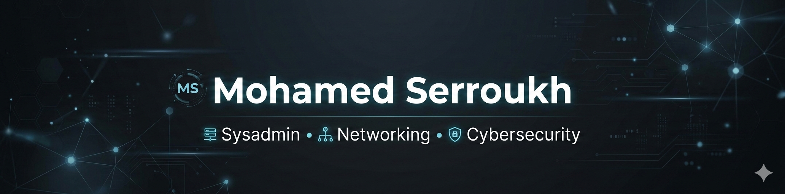

### Hey there! I'm Mohamed 👋
**SysAdmin & Network Infrastructure Specialist**

*"Ensuring technological continuity in mission-critical environments."*

 

## 🚀 About Me

IT Systems & Network Administrator focused on **offensive/defensive security** and robust infrastructure. Currently managing IT operations at **Mataró Hospital**, where 24/7 availability and data integrity are top priorities.

- 🏥 **Mission-Critical Environments** — Hands-on experience in Tier 2 support and clinical software deployment.
- 🔐 **Advanced Security** — Implementing IDS (**Snort**), **PKI (Internal CA)** management, and System Hardening.
- 🌐 **Networking** — Designing complex topologies, **VLANs**, routing protocols, and **VPNs** (Site-to-Site).
- ⚙️ **Automation** — Reducing operational overhead through **Python, Bash, and PowerShell** scripting.
- 📦 **Virtualization** — Managing **Proxmox VE** clusters and containerized environments with **Docker**.

 

## 📜 Certifications

| Badge | Certification | Issuer |
|-------|--------------|--------|
| 🛡️ | **CCST Cybersecurity** | Cisco |
| ☁️ | **SC-900: Security, Compliance & Identity** | Microsoft |
| 🐍 | **Python Specialist (IT Specialist)** | Certiport |

 

## 🛠️ Tech Stack

**Systems & Virtualization**

     

**Networking & Infrastructure**

      

**Security**

   

**Scripting & Automation**

  

**Web, Databases & Monitoring**

    

**Helpdesk & Version Control**

   

 

## 📊 GitHub Stats

 

## 📩 Contact Me

 

